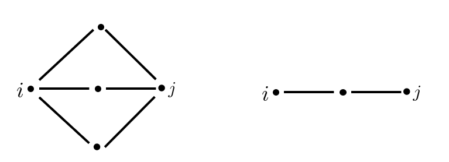

# 引入

在连通图$G$上，通常考察顶点$i,j\in V(G)$之间的最短距离$d(i,j)$。然而，距离的概念并不总是合适的。例如在上面两张图中，都有$d(i,j)=2$，但是，显然第一个图中有更多连接$i,j$的路径（或者说$i,j$之间可以更好地“通信”），因此，第一个图中$i,j$的距离比第二张图小比较合理。电阻距离是鉴于电网中电阻概念的一个解释，反映了通信的距离概念，所以是更恰当的。

同时，经典的最远距离除非在树上，否则难以用数学来处理，而电阻距离在数学上更容易处理。另外，对于树来说，最远距离和电阻距离是一致的。

# 用广义逆定义电阻距离

电阻距离有几个等价定义。首先给出关于广义逆的定义。

设$G$是一个有顶点集$V(G)=\{1,\cdots,n\}$的连通图，$L$是$G$的拉普拉斯矩阵，$H$是$L$的一个广义逆。令$i,j\in V(G)$，用$e_{ij}$表示第i个元素为1，第j个元素为-1，其余元素为0的$n\times1$阶向量。定义i与j之间的电阻距离$r(i,j)$如下：
$$
r(i,j)=e_{ij}^THe_{ij}=h_{ii}+h_{jj}-h_{ji}-h_{ij}
$$
如果$i=j$，则设定$r(i,j)=0$。

::: tip 注1
对于$L$的不同广义逆$H$，$e_{ij}^THe_{ij}$是相同的（可以由$(e_{ij},\mathbf{1})=0$得到）
:::
::: tip 注2
当$H$是$L$的一个对称广义逆（例如Moore-Penrose广义逆）时，$r(i,j)=h_{ii}+h_{jj}-2h_{ji}$
:::

# 电阻距离满足距离的要求

$r:V(G)\times V(G)\rightarrow \mathbb{R}$作为定义在$V(G)$上的距离函数应该满足以下性质：

&emsp;&emsp;（i）$\forall i,j \in V(G),r(i,j)\geq0$,当且仅当$i=j$时等号成立

&emsp;&emsp;（ii）$r(i,j)=r(j,i)$

&emsp;&emsp;（iii）$r(i,j)+r(j,k)\geq r(i,k)$

对于$n\leq2$容易证明，下面考虑$n\geq3$

（i）：设$M$是$L$的Moore-Penrose广义逆，设L的特征值分别为$0=\lambda_1<\lambda_2\le\lambda_3\le\cdots\le\lambda_n$，对应的单位特征向量分别为$x_1=\frac{\mathbf{1}}{\sqrt{n}},x_2,x_3,\cdots,x_n$，其中$x_i=\{x_i^1,x_i^2,\cdots,x_i^n\}(i=1,\cdots,n)$则L可以表示为$L=\sum_{i=1}^n\lambda_ix_ix_i^T$，M可以表示为$M=\sum_{i=2}^{n}\frac{1}{\lambda_i}x_ix_i^T$。考虑M的任意$2\times2$阶主子式，例如选第$p,q$行与$p,q$列交织得到的主子式（$p\neq q$），则$m_{pp}=\sum_{i=2}^n(x_i^p)^2,m_{qq}=\sum_{i=2}^n(x_i^q)^2,m_{pq}=\sum_{i=2}^nx_i^px_i^q$。由Cauchy不等式可知$m_{pp}m_{qq}>m_{pq}^2$，再由平均不等式知$m_{pp}+m_{qq}>2m_{pq}$，这表明$r(p,q)=m_{pp}+m_{qq}-2m_{pq}>0$

（ii）：显然

（iii）：先证明一个引理：在上述条件下，若B是L的一个任意的真主子矩阵，那么$B^{-1}$是一个元素非负的矩阵

证明：设B是L的一个$k\times k$阶真主子矩阵，$1\leq k \leq n-1$，运用数学归纳法证明。首先当$k=1$时显然成立。

假设对于阶数小于k的主子矩阵结论成立。由于$det(B)>0$，只需要证明B的所有代数余子式都是非负的。B的对角线元素的代数余子式是L的主子式，因此是非负的。下面证明B的非对角元元素$B(1,2)$的代数余子式是非负的，其余元素同理。将$B(1|2)$分块为
$$
B(1|2)=\left[\begin{array}{cc}
b_{21} & \mathbf{x}^T\\
\mathbf{y} & B(1,2|1,2)
\end{array}\right]
$$
于是$det (B(1|2))=det(B(1,2|1,2))(b_{21}-x^T(B(1,2|1,2)^{-1}y))$，根据假设，$B(1,2|1,2)^{-1}$中的元素都是非负的。另外$x,y$中的元素都是非正的，$det(B(1,2|1,2))\ge 0$，故$det (B(1|2))\le 0$，因此$B(1,2)$的代数余子式是非负的。引理得证。

接下来为了证明$r(i,j)+r(j,k)\ge r(j,k)$，只需证明对于L的任何广义逆H，有$h_{jj}+h_{ik}-h_{ij}-h_{jk}\ge 0$。令$B=L(j|j)$，则$det(B)$是L的一个余子式从而大于0（注：L的任意余子式相等），因此B是L的一个任意的真主子矩阵。由引理可知$B^{-1}\ge 0$。选择以下的L的广义逆H：在L中，由0取代第j行和第j列的元素，用$B^{-1}$取代$L(j|j)$。可以验证$LHL=L$，因此H是L的广义逆。此时$h_{jj}=h_{jk}=h_{jk}=0$并且因为$h_{ik}$是$B^{-1}$中元素，故$h_{ik}\ge 0$。因此$h_{jj}+h_{ik}-h_{ij}-h_{jk}=h_{ik}\ge 0$。证明完成。

::: tip 顺便的结果

令H是如上定义的广义逆，那么$r(i,j)=h_{ii}+h_{jj}-2h_{ij}=h_{ii}=\frac{det(L(i,j|i,j))}{det(L(j|j))}$

:::

